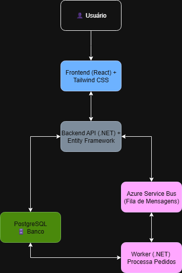
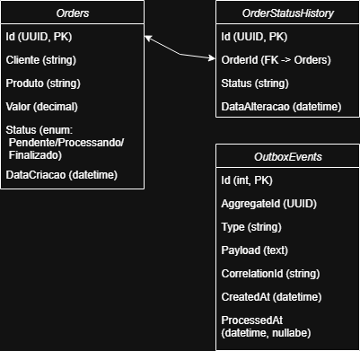

# Orders POC 🛒

POC de **gestão de pedidos** desenvolvida como parte de processo seletivo.  
O objetivo é demonstrar domínio em **.NET, React, PostgreSQL, mensageria e boas práticas de arquitetura**.

---

## 📌 Objetivo
- Criar, listar e visualizar pedidos.
- Publicar mensagens no **Azure Service Bus** quando um pedido é criado.
- Consumir mensagens em um **Worker**, atualizando o status do pedido (`Pendente → Processando → Finalizado`).
- Exibir os pedidos em uma interface moderna e responsiva.

---

## 🛠 Tecnologias Utilizadas

### Backend
- [.NET 9](https://dotnet.microsoft.com/pt-br/download) + C#
- Entity Framework Core + Npgsql
- Azure Service Bus SDK
- Health Checks

### Frontend
- [React](https://react.dev/)
- [TailwindCSS](https://tailwindcss.com/)
- Axios / React Query

### Infra
- Docker / Docker Compose
- PostgreSQL 15
- PgAdmin (opcional)

---

## 📐 Diagramas

### Arquitetura



Fluxo:
1. Usuário acessa o **Frontend** (React).
2. Frontend chama a **API Backend** (.NET).
3. API salva no **PostgreSQL** e envia evento ao **Azure Service Bus**.
4. O **Worker** consome a fila, processa o pedido e atualiza o banco.
5. Frontend exibe as mudanças de status em tempo real (ou via refresh).

---

### Modelo de Dados



Tabela **Orders**:
- `Id` (UUID, PK)
- `Cliente` (string)
- `Produto` (string)
- `Valor` (decimal)
- `Status` (enum: `Pendente`, `Processando`, `Finalizado`)
- `DataCriacao` (datetime)

---

## 🚀 Como Rodar Localmente

### Pré-requisitos
- [.NET 9+](https://dotnet.microsoft.com/pt-br/download)
- [Node.js 18+](https://nodejs.org/)
- [Docker Desktop](https://www.docker.com/products/docker-desktop)

### Passo 1 – Clonar o repositório
```bash
git clone https://github.com/seu-usuario/orders-poc.git
cd orders-poc
```

### Passo 2 – Variáveis de ambiente

Crie um arquivo .env na raiz com:

```env
POSTGRES_USER=postgres
POSTGRES_PASSWORD=postgres
POSTGRES_DB=ordersdb
POSTGRES_HOST=postgres

SERVICEBUS_CONNECTIONSTRING=Endpoint=sb://orderazurebus.servicebus.windows.net/;SharedAccessKeyName=RootManageSharedAccessKey;SharedAccessKey=WHA1Msuen+avkfHCCy8dUywKQ1Bi7g0BZ+ASbHooHxY=
```

### Passo 3 – Subir ambiente com Docker Compose

```bash
docker compose --env-file ../.env up -d --build
```

### Passo 4 – Rodar Frontend

```bash
cd frontend
npm install
npm run dev
```

---

## ✅ Endpoints Principais

### POST /orders
Cria um novo pedido.

**Request**
```json
{
  "cliente": "João da Silva",
  "produto": "Notebook",
  "valor": 4500.00
}
```

**Response**

```json
{
  "id": "a3b9f2b6-8d8c-4e32-8f7f-2cbe0d8f3e21",
  "cliente": "João da Silva",
  "produto": "Notebook",
  "valor": 4500.00,
  "status": "Pendente",
  "dataCriacao": "2025-09-18T14:22:00Z"
}
```

---

### GET /orders
Lista todos os pedidos cadastrados.

**Response**

```json
[
  {
    "id": "a3b9f2b6-8d8c-4e32-8f7f-2cbe0d8f3e21",
    "cliente": "João da Silva",
    "produto": "Notebook",
    "valor": 4500.00,
    "status": "Finalizado",
    "dataCriacao": "2025-09-18T14:22:00Z"
  }
]
```

---

### GET /orders/{id}
Retorna os detalhes de um pedido específico.

**Response**

```json
{
  "id": "a3b9f2b6-8d8c-4e32-8f7f-2cbe0d8f3e21",
  "cliente": "João da Silva",
  "produto": "Notebook",
  "valor": 4500.00,
  "status": "Processando",
  "dataCriacao": "2025-09-18T14:22:00Z"
}
```

---

## 🧪 Testes

- **Backend**
  - Testes unitários com **xUnit** para regras de negócio e serviços.
  - Testes de integração com banco de dados via **Docker**.
  - Testes de API simulando chamadas REST (ex.: criação e consulta de pedidos).

- **Frontend**
  - Testes de componentes com **Jest + React Testing Library**.
  - Testes de fluxo principal: criar pedido → listar pedidos → visualizar detalhes.

Para rodar os testes:
```bash
dotnet test
npm test
```
---

## 📈 Diferenciais Técnicos

- [ ]  Healthchecks implementados (API, Banco e Azure Service Bus).

- [ ] Sequência de status obrigatória Pendente → Processando → Finalizado.

- [ ] Histórico de status do pedido.

- [ ] Outbox Pattern para mensageria transacional.

- [ ] SignalR/WebSockets para atualização em tempo real.

- [ ] Testcontainers para integração.

- [ ] Módulo IA/Analytics para perguntas em linguagem natural.

---

## 🗂 Estrutura do Projeto

```bash
📦 order-management
 ┣ 📂 backend
 ┃ ┣ 📂 Orders.Api
 ┃ ┃ ┣ 📂 src
 ┃ ┃ ┃ ┣ 📂 Api        # Controllers e Endpoints
 ┃ ┃ ┃ ┣ 📂 Domain     # Entidades e regras de negócio
 ┃ ┃ ┃ ┣ 📂 Infra      # EF Core, Repositórios, Migrations
 ┃ ┃ ┣ 📂 tests        # Testes unitários e integração
 ┃ ┃ ┗ dockerfile
 ┣ 📂 docs           # Diagramas (arquitetura / banco)
 ┣ 📂 frontend       # React + Tailwind
 ┣ 📂 infra          # docker-compose.yml
 ┣ 📂 worker         
 ┃ ┣ 📂 Orders.Worker # Worker Service consumindo Service Bus
 ┣ README.md
 ┣ .gitignore
 ┗ .env.example
```

---

## 👨‍💻 Autor

- Luis Gabriel Verola Santos
- [LinkedIn](https://www.linkedin.com/in/lverola)
- [Github](https://www.github.com/lverola)